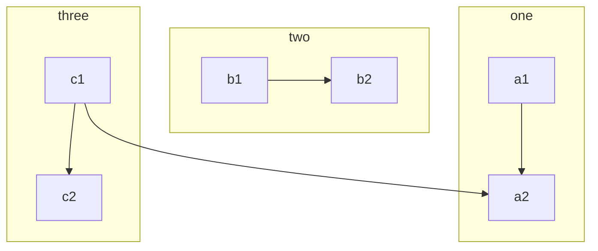
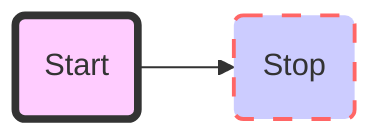
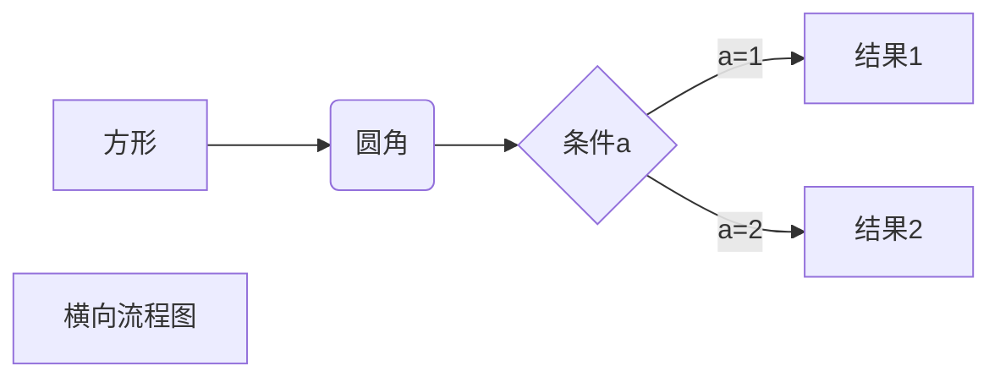
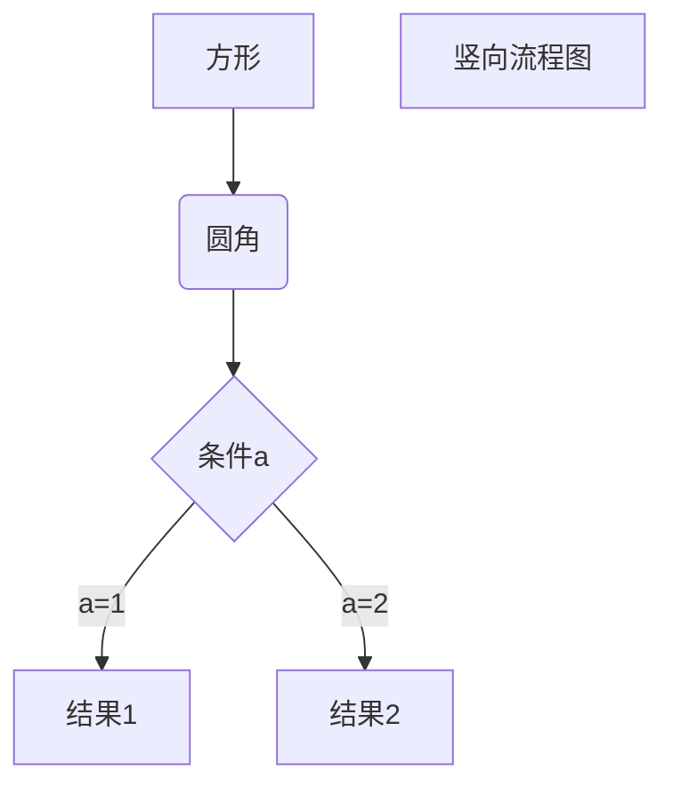
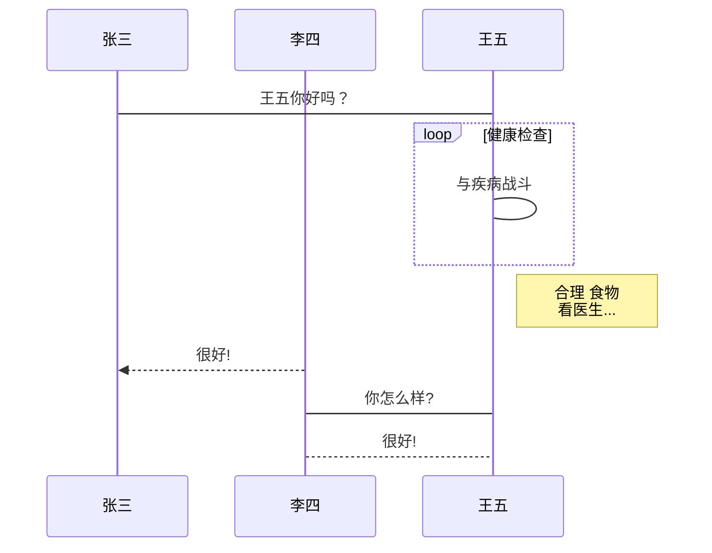

这世上总有太多不期而遇的温暖，
支撑着我们度过每个难熬的瞬间。 ———<!--more-->

# 一、标题

在想要设置为标题的文字前面加#来表示
一个#是一级标题，二个#是二级标题，以此类推。支持六级标题。

示例：

```
# 这是一级标题
## 这是二级标题
### 这是三级标题
#### 这是四级标题
##### 这是五级标题
###### 这是六级标题
```

效果如下：

# 这是一级标题

## 这是二级标题

### 这是三级标题

#### 这是四级标题

##### 这是五级标题

###### 这是六级标题


# 二、字体

- ##### 加粗

要加粗的文字左右分别用两个*号包起来

- ##### 斜体

要倾斜的文字左右分别用一个*号包起来

- ##### 斜体加粗

要倾斜和加粗的文字左右分别用三个*号包起来

- ##### 删除线

要加删除线的文字左右分别用两个~~号包起来


示例：

```
**这是加粗的文字**
*这是倾斜的文字*`
***这是斜体加粗的文字***
~~这是加删除线的文字~~
```

效果如下：

**这是加粗的文字**
*这是倾斜的文字*
***这是斜体加粗的文字***
~~这是加删除线的文字~~


# 三、引用

在引用的文字前加>即可。引用也可以嵌套，如加两个>>三个>>>
n个...
貌似可以一直加下去，但没神马卵用


示例：

```
>这是引用的内容
>>这是引用的内容
>>>>>>>>>>这是引用的内容
```


效果如下：

> 这是引用的内容
>
> > 这是引用的内容
> >
> > > > > > > > > > 这是引用的内容


# 四、分割线

三个或者三个以上的 - 或者 * 都可以。

示例：


```
---
----
***
*****
```

效果如下：
可以看到，显示效果是一样的。

---

----

***

*****


# 五、图片

语法:

```

```


效果如下：


# 六、超链接

语法：

```csharp
[超链接名](超链接地址 "超链接title")
title可加可不加
```


示例：

```csharp
[简书](http://jianshu.com)
[百度](http://baidu.com)
```


效果如下：

[GitHub](https://github.com/czzz911)
[百度](https://links.jianshu.com/go?to=http%3A%2F%2Fbaidu.com)

注：Markdown本身语法不支持链接在新页面中打开，貌似简书做了处理，是可以的。别的平台可能就不行了，如果想要在新页面中打开的话可以用html语言的a标签代替。

```xml
<a href="超链接地址" target="_blank">超链接名</a>

示例
<a href="https://www.jianshu.com/u/1f5ac0cf6a8b" target="_blank">简书</a>
```

# 七、列表

##### 无序列表

语法：
 无序列表用 - + * 任何一种都可以

```undefined
- 列表内容
+ 列表内容
* 列表内容

注意：- + * 跟内容之间都要有一个空格
```

效果如下：

- 列表内容
- 列表内容
- 列表内容

##### 有序列表

语法：
 数字加点

```undefined
1. 列表内容
2. 列表内容
3. 列表内容

注意：序号跟内容之间要有空格
```

效果如下：

1. 列表内容
2. 列表内容
3. 列表内容

##### 列表嵌套

**上一级和下一级之间敲三个空格即可**

- 一级无序列表内容
  - 二级无序列表内容
  - 二级无序列表内容
  - 二级无序列表内容
- 一级无序列表内容
  1. 二级有序列表内容
  2. 二级有序列表内容
  3. 二级有序列表内容

1. 一级有序列表内容
   - 二级无序列表内容
   - 二级无序列表内容
   - 二级无序列表内容
2. 一级有序列表内容
   1. 二级有序列表内容
   2. 二级有序列表内容
   3. 二级有序列表内容

# 八、表格

语法：

```ruby
表头|表头|表头
---|:--:|---:
内容|内容|内容
内容|内容|内容

第二行分割表头和内容。
- 有一个就行，为了对齐，多加了几个
文字默认居左
-两边加：表示文字居中
-右边加：表示文字居右
注：原生的语法两边都要用 | 包起来。此处省略
```

示例：


```ruby
姓名|技能|排行
--|:--:|--:
刘备|哭|大哥
关羽|打|二哥
张飞|骂|三弟
```

效果如下：

| 姓名 | 技能 | 排行 |
| ---- | :--: | ---: |
| 刘备 |  哭  | 大哥 |
| 关羽 |  打  | 二哥 |
| 张飞 |  骂  | 三弟 |

或者快捷键 ctrl + T

# 九、代码

**语法：**
 单行代码：代码之间分别用一个反引号包起来

```go
  `代码内容`
```

代码块：代码之间分别用三个反引号包起来，且两边的反引号单独占一行

~~~go
```
  代码...
  代码...
  代码...
```
~~~


**示例：**

单行代码

```go
`create database hero;`
```

代码块

~~~kotlin
```
    function fun(){
         echo "这是一句非常牛逼的代码";
    }
    fun();
```
~~~

**效果如下：**

单行代码

`create database hero;`

代码块

```kotlin
function fun(){
  echo "this is a code";
}
fun();
```

# 十、流程图

### 流程图源码格式

#### mermaid

**语法**

语法结构如下：`A[名称] --> B(名称)`
其中，A、B均代表形状名称，` -->`表示箭头指向，形状样式用后面的括号来表示，括号里面的内容是形状中要显示的文本内容。其中有以下几种形状：

| 括号形式 | 形状样式   |
| -------- | ---------- |
| [ ]      | 矩形框     |
| ( )      | 圆角矩形框 |
| { }      | 菱形       |
| (( ))    | 圆形       |

如果没有形状边框，可以写成：`C[语句] --> |语句| D[语句]`或者`C[语句] – 语句 --> D[语句]`都可以。
相对而言，比Flowchart更加简洁清晰，Mermaid还支持制作时序图、甘特图等，更多详细内容还可以参考网站：https://mermaid-js.github.io/mermaid/#/

**流程图方向有下面几个值**

- TB 从上到下
- BT 从下到上
- RL 从右到左
- LR 从左到右
- TD 同TB

**基本图形**

- id + [文字描述]矩形
- id + (文字描述)圆角矩形
- id + >文字描述]不对称的矩形
- id + {文字描述}菱形
- id + ((文字描述))圆形

#### 节点之间的连接

- A --> B     A带箭头指向B
- A --- B      A不带箭头指向B
- A -.- B      A用虚线指向B
- A -.-> B    A用带箭头的虚线指向B
- A ==> B   A用加粗的箭头指向B
- A -- 描述 --- B       A不带箭头指向B并在中间加上文字描述
- A -- 描述 --> B      A带箭头指向B并在中间加上文字描述
- A -. 描述 .-> B      A用带箭头的虚线指向B并在中间加上文字描述
- A == 描述 ==> B  A用加粗的箭头指向B并在中间加上文字描述

**子流程图**

**代码**

```
subgraph title
    graph definition
end
```

**效果**




**自定义样式**

语法：style id 具体样式

**代码**

```
graph LR	//mermaid
    id1(Start)-->id2(Stop)
    style id1 fill:#f9f,stroke:#333,stroke-width:4px,fill-opacity:0.5
    style id2 fill:#ccf,stroke:#f66,stroke-width:2px,stroke-dasharray: 10,5
```

**效果**




**1、横向流程图源码格式：**

```
​```mermaid
graph LR
A[方形] -->B(圆角)
    B --> C{条件a}
    C -->|a=1| D[结果1]
    C -->|a=2| E[结果2]
    F[横向流程图]
​```
```



**2、竖向流程图源码格式：**

```
​```mermaid
graph TD
A[方形] --> B(圆角)
    B --> C{条件a}
    C --> |a=1| D[结果1]
    C --> |a=2| E[结果2]
    F[竖向流程图]
​```
```



#### flow

**语法：**

语法结构如下：`X=>Y: Z`
其中，X是变量名， Y是指操作模块名，冒号后面的Z是具体显示的文字内容。需要注意的是，冒号后要加空格才能识别。
其中，变量名X和文字内容Z可以比较随意设置，但是Y是有固定的内容，主要有以下几种：

| 操作模块名  | 表示含义说明 |
| ----------- | ------------ |
| start       | 开始         |
| end         | 结束         |
| operation   | 普通操作块   |
| subroutine  | 子任务块     |
| condition   | 判断块       |
| inputoutput | 输入输出块   |

**转向控制**

下面一段是流程图的转向控制，`->`是表示下一步要执行的操作。如：`st->in->op->cond`，表示的是先从st转到in，然后再到op，最后到cond。这里可以连续写，也可以段开写，如写成下面的也是完全OK的。
`st->inin->opop->cond`

**判断分支**

其中，condition是判断，可以取yes和no两种结果，对于不同结果可以有不同走向。如：
`cond(yes)->out `表示condition成立时转向out执行；
`cond(no)->op`表示condition不成立时转向op执行；

如果需要设置流程图的样式或者其他设置，可以参考网址：http://flowchart.js.org/

</br>

流程图的语法大体分为两段，第一段用来定义元素，第二段用来连接元素
定义元素阶段的语法是
tag=>type: content:>url
tag就是一个标签，在第二段连接元素时用
type是这个标签的类型，从上段内容看有6中类型，分别为：

> start
> end
> operation
> subroutine
> condition
> inputoutput

content就是在框框中要写的内容，中英文均可，但有一点需要特别注意，就是type后的冒号与文本之间一定要有个空格，没空格会出问题。
url就是一个连接，与框框中的文本相绑定

连接元素阶段的语法就简单多了，直接用->来连接两个元素，需要注意的是condition类型，因为他有yes和no两个分支，所以要写成

> c2(yes)->io->e
> c2(no)->op2->e

3、标准流程图源码格式：**

```
​```flow
st=>start: 开始框
op=>operation: 处理框
cond=>condition: 判断框(是或否?)
sub1=>subroutine: 子流程
io=>inputoutput: 输入输出框
e=>end: 结束框
st->op->cond
cond(yes)->io->e
cond(no)->sub1(right)->op
​```
```

```flow
st=>start: 开始框
op=>operation: 处理框
cond=>condition: 判断框(是或否?)
sub1=>subroutine: 子流程
io=>inputoutput: 输入输出框
e=>end: 结束框
st->op->cond
cond(yes)->io->e
cond(no)->sub1(right)->op
```

**4、标准流程图源码格式（横向）：**

```
​```flow
st=>start: 开始框
op=>operation: 处理框
cond=>condition: 判断框(是或否?)
sub1=>subroutine: 子流程
io=>inputoutput: 输入输出框
e=>end: 结束框
st(right)->op(right)->cond
cond(yes)->io(bottom)->e
cond(no)->sub1(right)->op
​```
```

```flow
st=>start: 开始框
op=>operation: 处理框
cond=>condition: 判断框(是或否?)
sub1=>subroutine: 子流程
io=>inputoutput: 输入输出框
e=>end: 结束框
st(right)->op(right)->cond
cond(yes)->io(bottom)->e
cond(no)->sub1(right)->op
```


#### uml-sequence

5、UML时序图源码样例：**

```
​```sequence
对象A->对象B: 对象B你好吗?（请求）
Note right of 对象B: 对象B的描述
Note left of 对象A: 对象A的描述(提示)
对象B-->对象A: 我很好(响应)
对象A->对象B: 你真的好吗？
​```
```

```sequence
对象A->对象B: 对象B你好吗?（请求）
Note right of 对象B: 对象B的描述
Note left of 对象A: 对象A的描述(提示)
对象B-->对象A: 我很好(响应)
对象A->对象B: 你真的好吗？
```

**6、UML时序图源码复杂样例：**

```
​```sequence
Title: 标题：复杂使用
对象A->对象B: 对象B你好吗?（请求）
Note right of 对象B: 对象B的描述
Note left of 对象A: 对象A的描述(提示)
对象B-->对象A: 我很好(响应)
对象B->小三: 你好吗
小三-->>对象A: 对象B找我了
对象A->对象B: 你真的好吗？
Note over 小三,对象B: 我们是朋友
participant C
Note right of C: 没人陪我玩
​```
```

```sequence
Title: 标题：复杂使用
对象A->对象B: 对象B你好吗?（请求）
Note right of 对象B: 对象B的描述
Note left of 对象A: 对象A的描述(提示)
对象B-->对象A: 我很好(响应)
对象B->小三: 你好吗
小三-->>对象A: 对象B找我了
对象A->对象B: 你真的好吗？
Note over 小三,对象B: 我们是朋友
participant C
Note right of C: 没人陪我玩
```

#### uml-mermaid

**7、UML标准时序图样例：**

```
​```mermaid
%% 时序图例子,-> 直线，-->虚线，->>实线箭头
  sequenceDiagram
    participant 张三
    participant 李四
    张三->王五: 王五你好吗？
    loop 健康检查
        王五->王五: 与疾病战斗
    end
    Note right of 王五: 合理 食物 <br/>看医生...
    李四-->>张三: 很好!
    王五->李四: 你怎么样?
    李四-->王五: 很好!
​```
```



**8、甘特图**

```
​```mermaid
%% 语法示例
        gantt
        dateFormat  YYYY-MM-DD
        title 软件开发甘特图
        section 设计
        需求                      :done,    des1, 2014-01-06,2014-01-08
        原型                      :active,  des2, 2014-01-09, 3d
        UI设计                     :         des3, after des2, 5d
    未来任务                     :         des4, after des3, 5d
        section 开发
        学习准备理解需求                      :crit, done, 2014-01-06,24h
        设计框架                             :crit, done, after des2, 2d
        开发                                 :crit, active, 3d
        未来任务                              :crit, 5d
        耍                                   :2d
        section 测试
        功能测试                              :active, a1, after des3, 3d
        压力测试                               :after a1  , 20h
        测试报告                               : 48h
​```
```


# 十一、TOC

**代码**

```json
[TOC]
```

[TOC]

# 十二、任务列表

**代码**

```css
- [x] 选项一
- [ ] 选项二  
- [ ]  [选项3]
```

**演示**

- [x] 选项一
- [ ] 选项二  
- [ ] [选项3]

# 十三、支持内嵌CSS样式

**代码**

```xml
<p style="color: #AD5D0F;font-size: 30px; font-family: '宋体';">内联样式</p>
```

**演示**

<center><p style="color: #AD5D0F;font-size: 30px; font-family: '宋体';">内联样式</p></center>
# 十四、语义标签

| 描述     | 效果            | 代码              |
| -------- | --------------- | ----------------- |
| 斜体     | <i>斜体</i>     | `斜体`            |
| 加粗     | <b>加粗</b>     | `加粗`            |
| 强调     | <em>强调</em>   | `强调`            |
| 上标     | Z<sup>a</sup>   | `Z<sup>a</sup>`   |
| 下标     | Z<sub>a</sub>   | `Z<sub>a</sub>`   |
| 键盘文本 | <kbd>Ctrl</kbd> | `<kbd>Ctrl</kbd>` |
| 换行     |                 | ``                |

# 十五、格式化文本

**保持输入排版格式不变**
注：对内含标签需要破坏结构才能显示

```xml
<pre>
hello world 
         hi
  hello world 
</pre>
```

**演示**

<pre>
hello world 
         hi
  hello world 
</pre>

# 十六、脚注

**代码**

```csharp
Markdown[^1]
[^1]: Markdown是一种纯文本标记语言  
```

**演示**

Markdown[^1]

[^1]: Markdown是一种纯文本标记语言  

# 十七、公式

**代码**

```
$$
\mathbf{V}_1 \times \mathbf{V}_2 =  \begin{vmatrix} 
\mathbf{i} & \mathbf{j} & \mathbf{k} \\
\frac{\partial X}{\partial u} &  \frac{\partial Y}{\partial u} & 0 \\
\frac{\partial X}{\partial v} &  \frac{\partial Y}{\partial v} & 0 \\
\end{vmatrix}
${$tep1}{\style{visibility:hidden}{(x+1)(x+1)}}
$$
```
